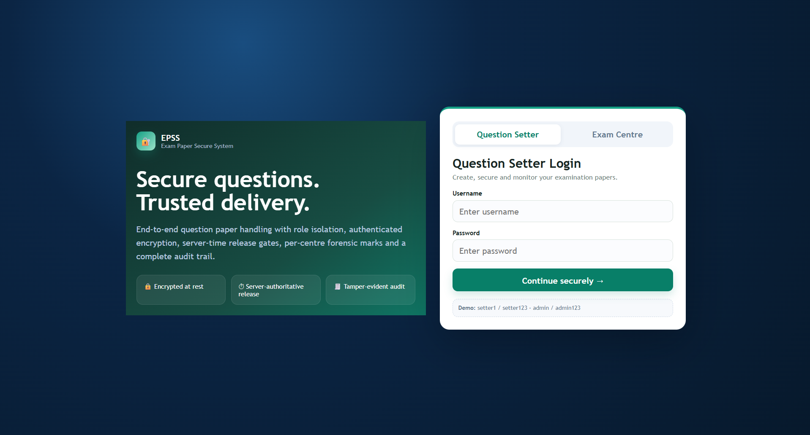
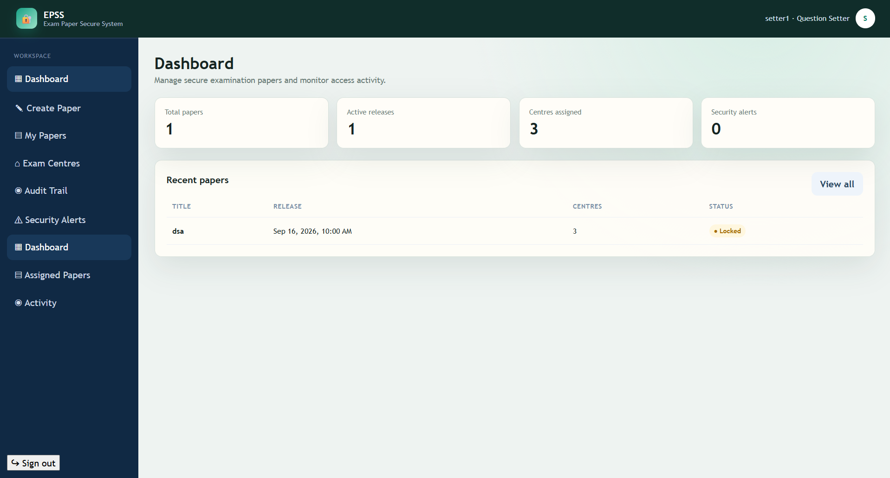
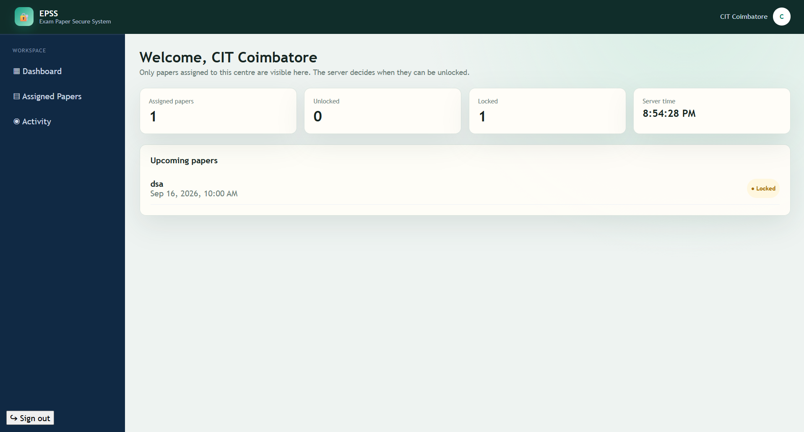
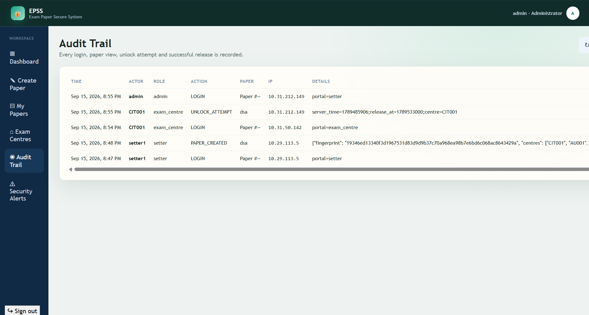

# EPSS — Exam Paper Secure System MVP

A deployable FastAPI + PostgreSQL/SQLite + browser client MVP for secure question-paper creation and controlled exam-centre delivery.

## Project description

EPSS is a secure examination-paper management system for question setters, administrators, and exam centres. Question setters create encrypted papers, assign them to one or more centres, and schedule their release. Exam centres can view only their assigned papers and can unlock them only after the server-controlled release time.

The system also provides SHA-256 content fingerprints, AES-256-GCM encryption, centre-specific forensic watermarks, recursive time-puzzle processing, role-based access control, tamper-evident audit events, and security alerts.

## Technologies and tools

- **Backend:** Python 3.12, FastAPI, Uvicorn
- **Database:** Neon PostgreSQL in production; SQLite fallback for local development
- **Database driver:** Psycopg 3
- **Cryptography:** `cryptography`, AES-256-GCM, SHA-256, HMAC, PBKDF2 password hashing
- **Frontend:** HTML, CSS, and browser JavaScript served by FastAPI
- **Deployment:** Docker, Docker Compose, Render Blueprint
- **Production database:** Neon PostgreSQL pooled connection

## Features

- Separate Question Setter and Exam Centre login portals
- Setter/admin paper creation and centre assignment
- Addable exam-centre directory
- Encrypted paper storage and fingerprint verification
- Per-centre hidden forensic watermark
- Server-authoritative release time
- Recursive SHA-256 time puzzle before successful unlock
- Centre-specific paper visibility
- Audit events for login, paper view, unlock attempts, and unlock success
- Security alerts for early or unauthorized unlock attempts
- PostgreSQL persistence through `DATABASE_URL`

## Render deployment

Use a **Neon PostgreSQL** database as the external store. In Neon, create a project and copy its **pooled connection string**. In Render, add it to the web service environment variables as `DATABASE_URL`:

- `DATABASE_URL` — Neon pooled connection string, including `sslmode=require` if Neon did not already include it.
- `APP_SECRET` — generate a long random secret; do not use the repository example.
- `PUZZLE_ROUNDS_PER_DAY` — optional puzzle effort setting.
- `MAX_PUZZLE_ROUNDS` — optional upper bound for puzzle effort.

All users, encrypted question content, paper fingerprints, centre assignments, watermarks, audit events, and alerts are stored in PostgreSQL when `DATABASE_URL` is set. No application data is written to the Render web service filesystem. The app automatically creates and seeds its tables on startup. `./data/mvp.db` is used only when `DATABASE_URL` is absent for local development.

The repository includes `render.yaml` for a Blueprint deployment. It asks Render for the secret `DATABASE_URL`; paste the Neon connection string into that generated environment-variable field. The app also accepts `NEON_DATABASE_URL` as a local alternative name.

## Main flow

1. **Question Setter** logs in and creates a paper.
2. Setter selects **one or many exam centres** from a reusable directory. New centres can be added with `+ Add Centre`.
3. The server computes a SHA-256 fingerprint, encrypts the paper using AES-256-GCM, and generates a **unique hidden forensic print per centre**.
4. The encrypted paper stays locked until `release_at`. The **server timestamp** is the authority; client clocks are not trusted. After release, the server computes a deterministic recursive SHA-256 puzzle whose rounds are derived from the scheduled delay and records `TIME_PUZZLE_SOLVED`.
5. **Exam Centre** logs in with its own centre account and sees only papers assigned to that centre.
6. Opening a paper creates a `PAPER_VIEW` audit event. Pressing **Try unlock / Unlock paper** always creates an `UNLOCK_ATTEMPT` event. Successful release creates `UNLOCK_SUCCESS`.
7. Setter/admin can inspect the authoritative audit trail and security alerts.

## Demo credentials

### Question Setter portal
- `setter1 / setter123`
- `setter2 / setter123`
- `admin / admin123` (admin sees all audit events/alerts)

### Exam Centre portal
- `CIT001 / centre123`
- `SSN001 / centre123`
- `REC001 / centre123`

## Run

```bash
docker compose up --build
```

Open **http://localhost:8000**.

## Installation without Docker

Create and activate a virtual environment, then install the dependencies:

```bash
python -m venv .venv
\.venv\Scripts\Activate.ps1       # Windows PowerShell
# source .venv/bin/activate         # macOS/Linux
pip install -r requirements.txt
```

Start the development server:

```bash
uvicorn app.main:app --host 0.0.0.0 --port 8000 --reload
```

For local development, omit `DATABASE_URL` to use `data/mvp.db`. For Neon, configure `DATABASE_URL` using the values shown in `.env.example` or set it in the hosting provider. Never commit real credentials or production secrets.

## Project structure

```text
question-secure-mvp/
├── app/
│   └── main.py              # FastAPI app, API routes, schema setup, auth, crypto, audit logic
├── static/
│   └── index.html           # Browser UI for setter and exam-centre portals
├── data/
│   └── mvp.db               # Local SQLite database; not used when DATABASE_URL is configured
├── requirements.txt         # Python dependencies
├── Dockerfile               # Production container image
├── docker-compose.yml        # Local container development configuration
├── render.yaml              # Render deployment configuration for Neon DATABASE_URL
├── .env.example             # Environment-variable template
└── README.md                # Project documentation
```

### Main backend modules

`app/main.py` contains the current MVP modules:

- Database adapter and schema initialization for SQLite/PostgreSQL
- `app_users` authentication and role checks
- Centre directory and paper-assignment management
- AES-GCM encryption and SHA-256 fingerprint verification
- Time-puzzle generation and server-time release enforcement
- Centre-specific watermark generation
- Audit-chain recording and security-alert creation
- Setter and exam-centre API endpoints

## API highlights

- `POST /api/login`
- `GET /api/me`
- `GET /api/centres`
- `POST /api/centres`
- `POST /api/questions`
- `GET /api/questions`
- `GET /api/exam/papers`
- `GET /api/exam/papers/{id}` — logs `PAPER_VIEW`
- `POST /api/exam/papers/{id}/unlock` — logs `UNLOCK_ATTEMPT` and then `UNLOCK_SUCCESS`
- `GET /api/audit`
- `GET /api/papers/{id}/audit`
- `GET /api/alerts`

## Sample input and output

### Login request

```http
POST /api/login
Content-Type: application/json

{
	"username": "setter1",
	"password": "setter123",
	"login_as": "setter"
}
```

### Login response

```json
{
	"token": "<signed-session-token>",
	"user": {
		"username": "setter1",
		"role": "setter",
		"scope": "all",
		"centre": null
	}
}
```

### Create-paper request

```json
{
	"title": "Data Structures Mid-Semester",
	"description": "Internal assessment paper",
	"content": "1. Explain binary search trees.\n2. Implement graph traversal.",
	"release_at": 1790000000,
	"centre_ids": ["centre-id-from-api"]
}
```

Send it to `POST /api/questions` with the login token:

```text
Authorization: Bearer <signed-session-token>
```

### Create-paper response

```json
{
	"id": 12,
	"fingerprint": "<sha256-fingerprint>",
	"release_at": 1790000000,
	"puzzle_rounds": 1000,
	"watermarks": {
		"CIT001": "EPSS-<centre-specific-mark>"
	}
}
```

Before the release time, `POST /api/exam/papers/{id}/unlock` returns HTTP `403`, records `UNLOCK_ATTEMPT`, and creates a security alert. After release, the server verifies the time puzzle, decrypts the paper, checks its fingerprint, and records `UNLOCK_SUCCESS`.

The puzzle effort is configurable with `PUZZLE_ROUNDS_PER_DAY` and `MAX_PUZZLE_ROUNDS`. The default is intentionally demo-sized; increase it only after load testing the release service.

## Important production limitations

This is an MVP, not a certified examination-security system. A web app cannot prove that a workstation is physically air-gapped, guarantee that a proof-of-work puzzle takes an exact number of days on arbitrary hardware, or reliably establish physical GPS geofencing from a browser alone. For a high-assurance deployment, the encryption key should be kept in an HSM/KMS and released only through a hardened, authenticated release service; authoring machines should also be locked down with network isolation, removable-media controls, device attestation, centre network allowlists, and physical security.

## Screenshots

### Login



### Question Setter Dashboard



### Exam Centre Dashboard



### Audit Trail

